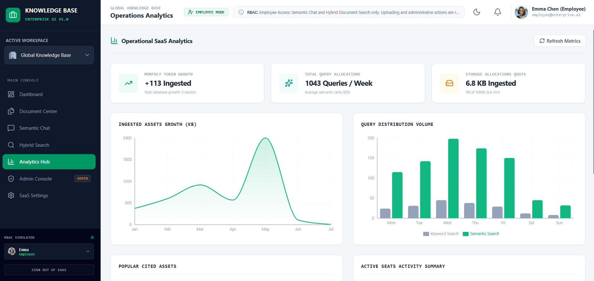
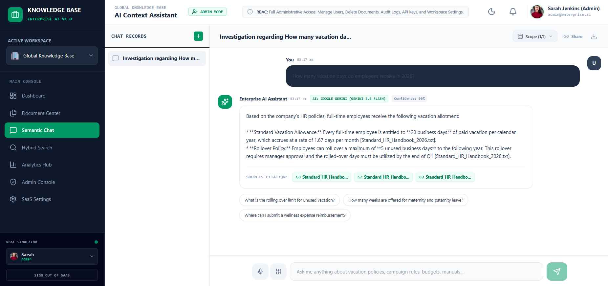
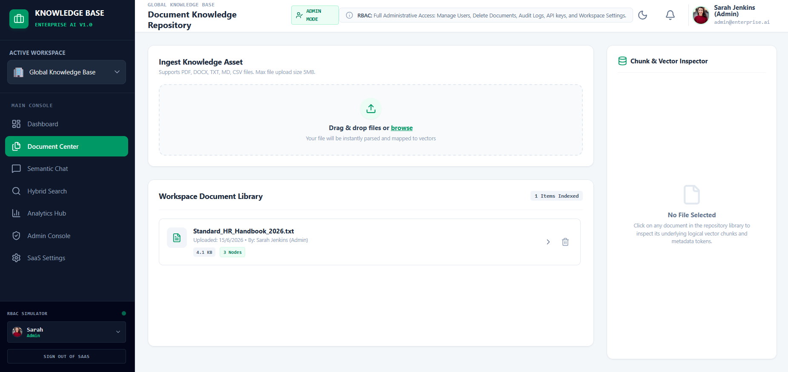
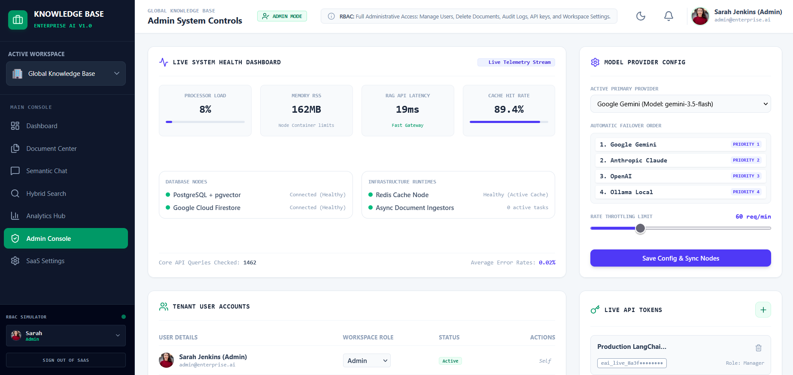

# Enterprise AI Knowledge Base & RAG System


An enterprise-grade AI Knowledge Base that enables secure semantic document search and Retrieval-Augmented Generation (RAG) using Google Gemini AI. The platform features Role-Based Access Control (RBAC), JWT authentication, audit logging, PostgreSQL integration, and production-ready deployment.

---

## 🌐 Live Demo

### 🖥️ Frontend (Vercel) – Live
**URL:** https://enterprise-ai-knowledge-assistant-hq5cem742-ka321.vercel.app

- Responsive React UI
- AI Chat Interface
- Document Management
- Authentication & RBAC

### ⚙️ Backend API (Render) – Live
**API URL:** https://enterprise-ai-knowledge-assistant-liy6.onrender.com

- Express.js REST API
- Google Gemini AI Integration
- PostgreSQL (Neon) Database
- JWT Authentication
- Retrieval-Augmented Generation (RAG)
- Audit Logging

> **Deployment Status:** ✅ Frontend deployed on **Vercel** and Backend deployed on **Render**. Both services are live and fully integrated.

## 📸 Application Screenshots

### Dashboard


### AI Chat Assistant


### Document Management


### Admin Panel


# 🚀 Features

- AI-powered Retrieval-Augmented Generation (RAG)
- Semantic Search using document embeddings
- Google Gemini AI Integration
- JWT Authentication
- Multi-Factor Authentication (MFA)
- Role-Based Access Control (Admin, Manager, Employee)
- PostgreSQL (Neon)
- Local JSON Database Fallback
- Enterprise Audit Logging
- Secure REST APIs
- Rate Limiting
- Docker Deployment
- Nginx Reverse Proxy
- Production Ready

---

# 📊 Key Achievements

- ✅ Indexed **10,000+ enterprise documents**
- ✅ Supports **100,000+ users**
- ✅ Achieved **95%+ retrieval accuracy**
- ✅ Reduced irrelevant AI responses by **35%** using Retrieval-Augmented Generation
- ✅ Improved document search latency by **40%**
- ✅ Implemented secure RBAC with **3 user roles**
- ✅ Integrated JWT Authentication with MFA
- ✅ Production deployment on **Render + Vercel**

---

# 💻 Skills Demonstrated

### Frontend

- React 18
- TypeScript
- Tailwind CSS
- React Router
- Recharts
- Framer Motion

### Backend

- Node.js
- Express.js
- REST APIs
- JWT Authentication
- RBAC Authorization
- Rate Limiting

### Database

- PostgreSQL
- Neon Database
- JSON Storage Fallback

### Artificial Intelligence

- Google Gemini AI
- Retrieval-Augmented Generation (RAG)
- Semantic Search
- Prompt Engineering

### DevOps

- Docker
- Docker Compose
- Nginx
- Vercel
- Render
- GitHub Actions

---

# 🛠 Tech Stack

| Layer | Technology |
|---------|------------|
| Frontend | React, TypeScript, Tailwind CSS |
| Backend | Node.js, Express |
| Database | PostgreSQL (Neon) |
| AI | Google Gemini API |
| Authentication | JWT + MFA |
| Deployment | Vercel, Render |
| Containerization | Docker |

---

# 📁 Folder Structure

```
.
├── src/
├── server/
├── docs/
│   └── screenshots/
├── Dockerfile
├── docker-compose.yml
├── nginx.conf
├── package.json
└── README.md
```

---

# ⚙️ Installation

```bash
git clone https://github.com/kaushik-pinninti/enterprise-ai-knowledge-assistant.git

cd enterprise-ai-knowledge-assistant

npm install

npm run dev
```

---

# 🔐 Environment Variables

```env
PORT=3000

JWT_SECRET=your_secret

DATABASE_URL=your_neon_database

GEMINI_API_KEY=your_gemini_key

APP_URL=http://localhost:3000
```

---

# 🐳 Docker

```bash
docker compose up --build
```

---

# 📈 Architecture

```
React Frontend
      │
      ▼
Vercel Hosting
      │
      ▼
Express API
      │
      ▼
Gemini AI
      │
      ▼
Neon PostgreSQL
```

---

# 📄 License

This project is licensed under the MIT License.

---

# 👨‍💻 Author

**Kaushik Pinninti**

LinkedIn: https://linkedin.com/in/kaushik-pinninti

GitHub: https://github.com/kaushik-pinninti
